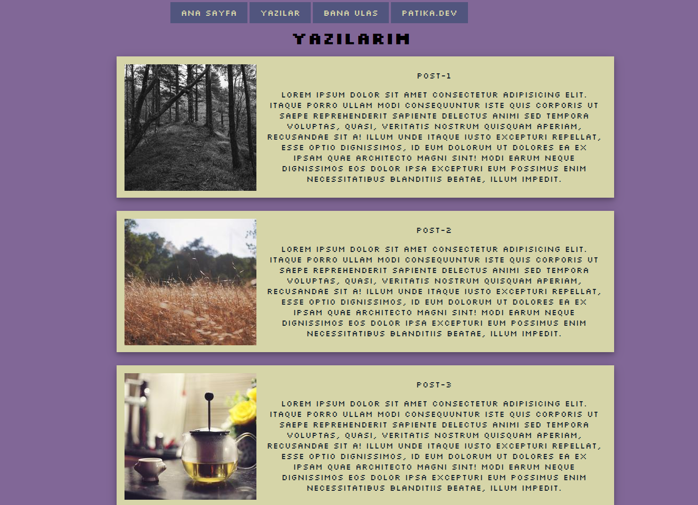

# Kodluyoruz CSS Projesi
Bu repo [patika.dev](https://patika.dev) platformu CSS dersleri için oluşturulmuştur.

## Proje Görünümü


## Kurulum
----
Ilk olarak repoyu bilgisayarınıza klonlayın.
```
git clone https://github.com/ertugrulsisman/css1.git
```
## Kullanım
---
Projeyi cloneladıktan sonra Visual Studio Code programında açınız.
```
cd a-template
code .
```
